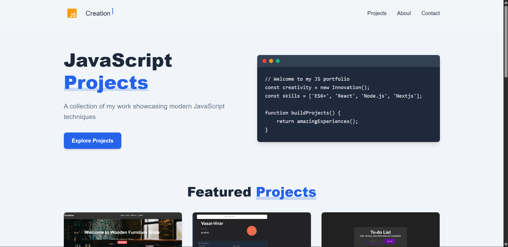
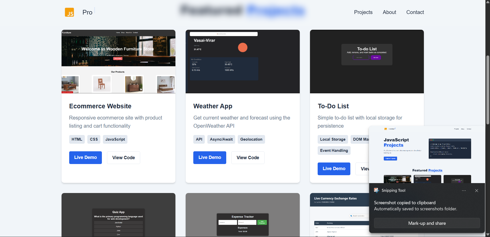

# 💼 JavaScript Projects Portfolio

This is a **personal portfolio website** showcasing my JavaScript and frontend development projects.
The portfolio highlights various web applications built using **HTML, CSS, and JavaScript**, demonstrating practical knowledge of modern web development.

The goal of this portfolio is to present my projects, technical skills, and development experience in a clean and user-friendly interface.

---

## 🚀 Features

* 📂 Showcase of multiple **JavaScript projects**
* 📱 **Responsive design** for mobile and desktop
* 🎨 Clean and modern **UI layout**
* 🔗 Direct links to **live demos and GitHub repositories**
* ⚡ Fast and lightweight static website

---

## 🛠️ Built With

* **HTML5**
* **CSS3**
* **JavaScript (ES6+)**

---

## 📂 Projects Included

Some of the projects featured in this portfolio:

* 💱 **GlobexRates** – Live currency exchange rate and converter application
* 💬 **WorkConnect** – Real-time chat application using Socket.IO
* 📝 JavaScript utility and practice projects
* 🌐 Other frontend web applications

---

## 📸 Screenshots

## 📸 Screenshots

### Portfolio Homepage


### Projects Section



---

## 🌐 Live Demo

Visit the live portfolio:

```id="2fq5l0"
[https://your-portfolio-link.com](https://myjs-projects.netlify.app/)
```

---

## ⚙️ Installation

To run the project locally:

```bash id="2emh5c"
git clone https://github.com/SwarajThakre/js-portfolio.git
cd js-portfolio
```

Then open **index.html** in your browser.

---

## 📚 Learning Purpose

This project was built to practice and demonstrate:

* JavaScript fundamentals
* DOM manipulation
* Responsive web design
* Building and organizing multiple frontend projects
* Creating a developer portfolio

---

## 👨‍💻 Author

**Swaraj Thakre**

📧 Email: [swarajthakre.stud@gmail.com](mailto:swarajthakre.stud@gmail.com)
💼 LinkedIn: https://www.linkedin.com/in/swaraj-thakre2629
🐙 GitHub: https://github.com/SwarajThakre
🌐 Portfolio: https://swarajthakre26.netlify.app

---

⭐ If you like this project, consider giving it a **star on GitHub**.
